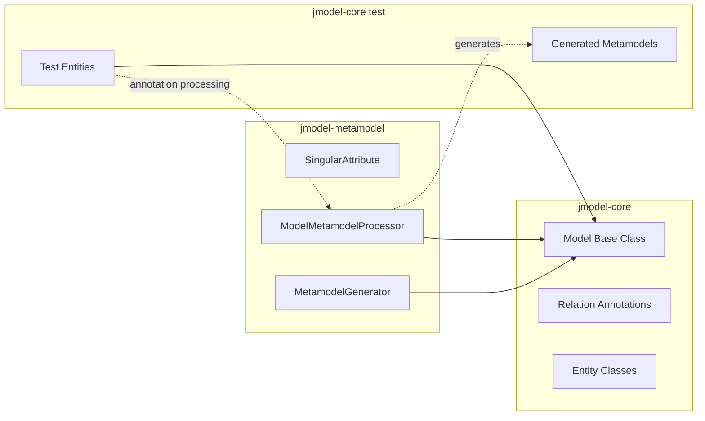
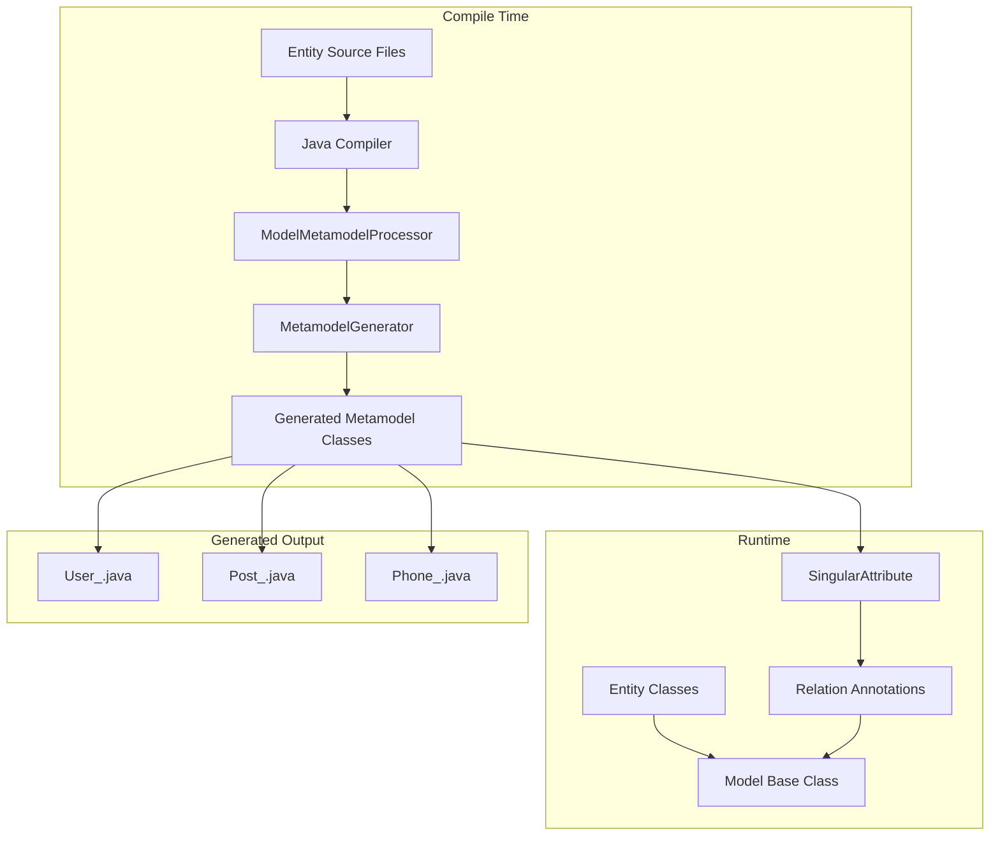
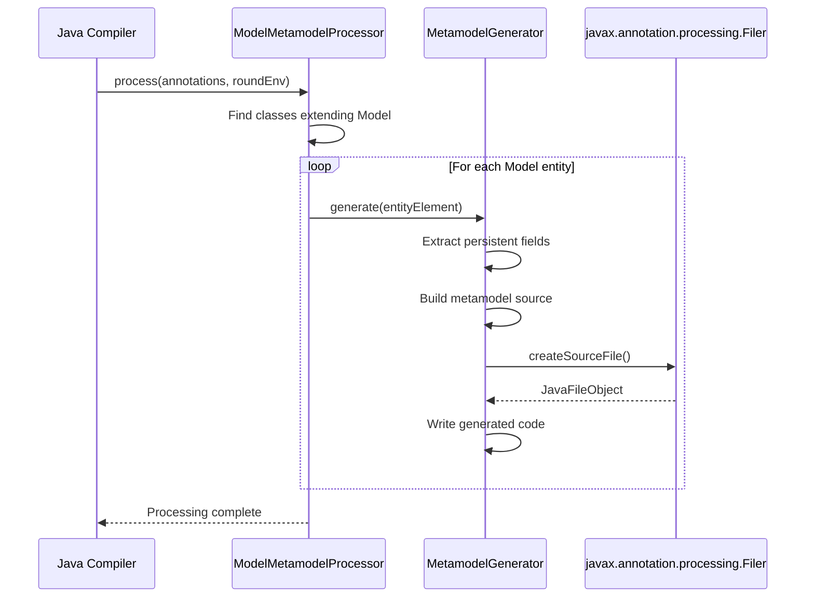

# Design Document: Static Metamodel Generator

## Overview

The Static Metamodel Generator is a compile-time annotation processor that generates type-safe static attribute classes for jmodel entities. This feature enables developers to reference entity fields using generated static constants instead of error-prone string literals, providing compile-time type safety and IDE auto-completion support.

The implementation follows the established pattern from Hibernate JPA's static metamodel, adapted for the jmodel framework's architecture built on MyBatis-Plus.

## Architecture

### Multi-Module Project Structure

The project is structured as a multi-module Maven project to ensure the annotation processor can execute correctly during compilation:

```
jmodel/
├── pom.xml                          # Parent POM
├── jmodel-core/                     # Core ORM module
│   ├── pom.xml
│   └── src/
│       ├── main/java/               # Model, relations, utilities
│       └── test/java/               # Entity tests (uses jmodel-metamodel)
└── jmodel-metamodel/                # Metamodel processor module
    ├── pom.xml
    └── src/
        └── main/java/               # SingularAttribute, Processor
```

### Module Dependencies



### Compile-Time Flow



### Component Interaction Flow



## Components and Interfaces

### 1. SingularAttribute<E, T>

The core attribute class representing a single-valued persistent attribute.

```java
package com.github.biiiiiigmonster.metamodel;

/**
 * Represents a single-valued persistent attribute in the static metamodel.
 * 
 * @param <E> The entity type that declares this attribute
 * @param <T> The type of the attribute
 */
public class SingularAttribute<E, T> {
    private final String name;
    private final Class<E> declaringType;
    private final Class<T> javaType;
    
    public SingularAttribute(String name, Class<E> declaringType, Class<T> javaType);
    
    /** Returns the field name as a string for use in queries and relations */
    public String getName();
    
    /** Returns the entity class that declares this attribute */
    public Class<E> getDeclaringType();
    
    /** Returns the Java type of this attribute */
    public Class<T> getJavaType();
    
    /** Returns the field name - enables implicit string conversion */
    @Override
    public String toString();
}
```

### 2. ModelMetamodelProcessor

The annotation processor that discovers Model entities and triggers generation.

```java
package com.github.biiiiiigmonster.metamodel.processor;

@SupportedAnnotationTypes("*")
@SupportedSourceVersion(SourceVersion.RELEASE_8)
public class ModelMetamodelProcessor extends AbstractProcessor {
    
    /** Process all types and find Model subclasses */
    @Override
    public boolean process(Set<? extends TypeElement> annotations, RoundEnvironment roundEnv);
    
    /** Check if a type extends Model */
    private boolean isModelSubclass(TypeElement typeElement);
    
    /** Generate metamodel for a single entity */
    private void generateMetamodel(TypeElement entityElement);
}
```

### 3. MetamodelGenerator

Responsible for generating the actual metamodel source code.

```java
package com.github.biiiiiigmonster.metamodel.processor;

public class MetamodelGenerator {
    
    /** Generate metamodel class source code for an entity */
    public String generate(TypeElement entityElement, ProcessingEnvironment processingEnv);
    
    /** Extract persistent fields from entity (excluding @TableField(exist=false)) */
    private List<VariableElement> extractPersistentFields(TypeElement entityElement);
    
    /** Generate static attribute declaration for a field */
    private String generateAttributeDeclaration(VariableElement field, String entityClassName);
    
    /** Check if field should be included in metamodel */
    private boolean isPersistentField(VariableElement field);
}
```

### 4. Generated Metamodel Class Structure

Example of generated output for `User` entity:

```java
package com.github.biiiiiigmonster.entity;

import com.github.biiiiiigmonster.metamodel.SingularAttribute;
import javax.annotation.Generated;

@Generated(
    value = "com.github.biiiiiigmonster.metamodel.processor.ModelMetamodelProcessor",
    date = "2025-12-16T00:00:00.000Z"
)
public abstract class User_ {
    public static volatile SingularAttribute<User, Long> id;
    public static volatile SingularAttribute<User, String> name;
    public static volatile SingularAttribute<User, String> email;
    
    public static final String ID = "id";
    public static final String NAME = "name";
    public static final String EMAIL = "email";
    
    static {
        id = new SingularAttribute<>("id", User.class, Long.class);
        name = new SingularAttribute<>("name", User.class, String.class);
        email = new SingularAttribute<>("email", User.class, String.class);
    }
}
```

## Data Models

### Field Metadata Extraction

The processor extracts the following metadata from entity fields:

| Metadata | Source | Usage |
|----------|--------|-------|
| Field Name | `VariableElement.getSimpleName()` | Attribute name and string constant |
| Field Type | `VariableElement.asType()` | Generic type parameter T |
| Declaring Class | `TypeElement.getQualifiedName()` | Generic type parameter E |
| TableField Annotation | `@TableField(exist=false)` | Filter non-persistent fields |
| TableId Annotation | `@TableId` | Identify primary key field |

### Type Mapping

| Java Type | Generated Attribute Type |
|-----------|-------------------------|
| `long` / `Long` | `SingularAttribute<E, Long>` |
| `int` / `Integer` | `SingularAttribute<E, Integer>` |
| `String` | `SingularAttribute<E, String>` |
| `LocalDateTime` | `SingularAttribute<E, LocalDateTime>` |
| `Date` | `SingularAttribute<E, Date>` |
| `Enum` types | `SingularAttribute<E, EnumType>` |
| Custom types | `SingularAttribute<E, CustomType>` |


## Correctness Properties

*A property is a characteristic or behavior that should hold true across all valid executions of a system-essentially, a formal statement about what the system should do. Properties serve as the bridge between human-readable specifications and machine-verifiable correctness guarantees.*

Based on the prework analysis, the following correctness properties have been identified:

### Property 1: Metamodel Generation Completeness

*For any* Model entity class with N persistent fields (excluding `@TableField(exist=false)`), the generated metamodel class SHALL contain exactly N static `SingularAttribute` fields.

**Validates: Requirements 1.3, 1.4**

### Property 2: Field Name Preservation (Round-Trip)

*For any* persistent field in a Model entity, the generated `SingularAttribute.getName()` SHALL return the exact field name string, and `SingularAttribute.toString()` SHALL also return the same field name.

**Validates: Requirements 2.1, 2.4**

### Property 3: Type Information Preservation

*For any* persistent field with type T in a Model entity, the generated `SingularAttribute<E, T>` SHALL have `getJavaType()` return the class corresponding to type T.

**Validates: Requirements 2.2, 5.1, 5.2, 5.3, 5.4, 5.5**

### Property 4: Declaring Type Consistency

*For any* `SingularAttribute` generated for entity E, the `getDeclaringType()` method SHALL return the class object for entity E.

**Validates: Requirements 2.3**

### Property 5: Package Location Consistency

*For any* Model entity in package P, the generated metamodel class SHALL be placed in the same package P.

**Validates: Requirements 1.2**

### Property 6: Non-Persistent Field Exclusion

*For any* field annotated with `@TableField(exist = false)` in a Model entity, the generated metamodel class SHALL NOT contain a corresponding static attribute.

**Validates: Requirements 1.4**

### Property 7: Generated Annotation Presence

*For any* generated metamodel class, the class SHALL be annotated with `@Generated` containing the processor class name.

**Validates: Requirements 4.4**

## Error Handling

### Compile-Time Error Handling

| Error Condition | Handling Strategy |
|-----------------|-------------------|
| Entity class not accessible | Log warning, skip entity |
| Field type cannot be resolved | Use `Object.class` as fallback type |
| Cannot create output file | Report error via `Messager`, fail gracefully |
| Circular type references | Handle via lazy initialization in static block |

### Runtime Error Handling

| Error Condition | Handling Strategy |
|-----------------|-------------------|
| Metamodel class not found | Throw `MetamodelNotFoundException` with helpful message |
| Attribute access on null | Standard NPE (no special handling needed) |

### Error Messages

The processor SHALL provide clear, actionable error messages:

```
[ERROR] Failed to generate metamodel for entity 'com.example.User': 
        Cannot resolve field type for 'customField'. 
        Ensure all dependencies are on the classpath.
```

## Testing Strategy

### Dual Testing Approach

This feature requires both unit tests and property-based tests to ensure correctness:

- **Unit tests**: Verify specific examples, edge cases, and error conditions
- **Property-based tests**: Verify universal properties that should hold across all inputs

### Property-Based Testing Framework

The implementation SHALL use **jqwik** as the property-based testing library for Java. jqwik integrates well with JUnit 5 and provides powerful generators for creating arbitrary test data.

Maven dependency:
```xml
<dependency>
    <groupId>net.jqwik</groupId>
    <artifactId>jqwik</artifactId>
    <version>1.8.2</version>
    <scope>test</scope>
</dependency>
```

### Property-Based Test Requirements

1. Each property-based test SHALL run a minimum of 100 iterations
2. Each property-based test SHALL be tagged with a comment referencing the correctness property: `**Feature: static-metamodel, Property {number}: {property_text}**`
3. Each correctness property SHALL be implemented by a SINGLE property-based test

### Test Categories

#### 1. SingularAttribute Unit Tests
- Test `getName()` returns correct field name
- Test `getJavaType()` returns correct type class
- Test `getDeclaringType()` returns correct entity class
- Test `toString()` returns field name
- Test equality and hashCode behavior

#### 2. MetamodelGenerator Property Tests
- Property 1: Generation completeness (field count matches)
- Property 2: Field name round-trip preservation
- Property 3: Type information preservation
- Property 6: Non-persistent field exclusion

#### 3. Annotation Processor Integration Tests
- Test processor discovers Model subclasses
- Test generated files are placed in correct package
- Test @Generated annotation is present
- Test error handling for malformed entities

#### 4. End-to-End Compilation Tests
- Compile sample entities and verify metamodel generation
- Verify generated code compiles without errors
- Verify generated attributes can be used in relation definitions

### Test Data Generators (for jqwik)

```java
@Provide
Arbitrary<FieldDefinition> persistentFields() {
    return Combinators.combine(
        Arbitraries.strings().alpha().ofMinLength(1).ofMaxLength(20),
        Arbitraries.of(String.class, Long.class, Integer.class, 
                       LocalDateTime.class, Boolean.class)
    ).as(FieldDefinition::new);
}

@Provide
Arbitrary<EntityDefinition> modelEntities() {
    return persistentFields().list().ofMinSize(1).ofMaxSize(10)
        .map(fields -> new EntityDefinition("TestEntity", fields));
}
```
